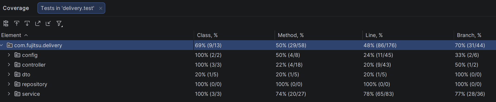

# Fujitsu Delivery Fee Calculator

A REST API that calculates delivery fees based on city, vehicle type, and current weather conditions.

## What it does

- Fetches live weather data from the Estonian Environment Agency every 15 minutes.
- Calculates a delivery fee for a given city and vehicle type.
- Adds extra charges (or blocks delivery entirely) based on temperature, wind speed, and weather conditions.
- Lets you query fees for a past point in time using an optional date parameter.

## Tech stack

- Java 17
- Spring Boot 4.0.4
- Spring Data JPA + H2 (embedded database, persisted to `./data/deliverydb`)
- Gradle

## How to run

```bash
./gradlew bootRun
```

The app starts on `http://localhost:8080`.

Swagger UI is available at `http://localhost:8080/swagger-ui.html` (explore and try all endpoints).

The H2 console is at `http://localhost:8080/h2-console` (username: `admin`, password: `admin`).

## API usage

### Calculate delivery fee

```
GET /api/delivery-fee
```

| Parameter     | Required | Values                                | Description                     |
|---------------|----------|---------------------------------------|---------------------------------|
| `city`        | yes      | `TALLINN`, `TARTU`, `PÄRNU`           | City of delivery                |
| `vehicleType` | yes      | `CAR`, `SCOOTER`, `BIKE`              | Courier vehicle type            |
| `dateTime`    | no       | ISO 8601 (e.g. `2024-03-20T12:00:00`) | Use weather data from this time |

**Example:**

```
GET /api/delivery-fee?city=TALLINN&vehicleType=SCOOTER
```

```json
{ "fee": 4.0 }
```

**Error responses:**
- `400`: invalid city or vehicle type
- `404`: no weather data found for that city/time
- `422`: weather conditions forbid the selected vehicle

## How fees are calculated

The total fee is: **base fee + weather extras**.

### Base fees (euros)

| City     | Car  | Scooter | Bike |
|----------|------|---------|------|
| Tallinn  | 4.00 | 3.50    | 3.00 |
| Tartu    | 3.50 | 3.00    | 2.50 |
| Parnu    | 3.00 | 2.50    | 2.00 |

### Weather extras (scooter and bike only)

| Condition                        | Extra |
|----------------------------------|-------|
| Temperature -10°C to 0°C         | +0.50 |
| Temperature below -10°C          | +1.00 |
| Wind speed 10–20 m/s (bike only) | +0.50 |
| Rain                             | +0.50 |
| Snow or sleet                    | +1.00 |

### Forbidden conditions (delivery blocked)

| Condition                    | Affects       |
|------------------------------|---------------|
| Wind speed over 20 m/s       | Bike          |
| Glaze, hail, or thunderstorm | Scooter, Bike |

Cars are never affected by weather extras.

## Running the tests

```bash
./gradlew test
```

## Code Coverage

